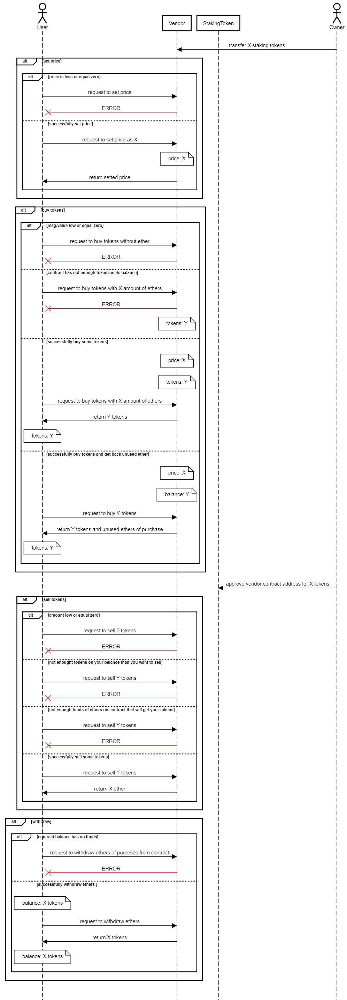
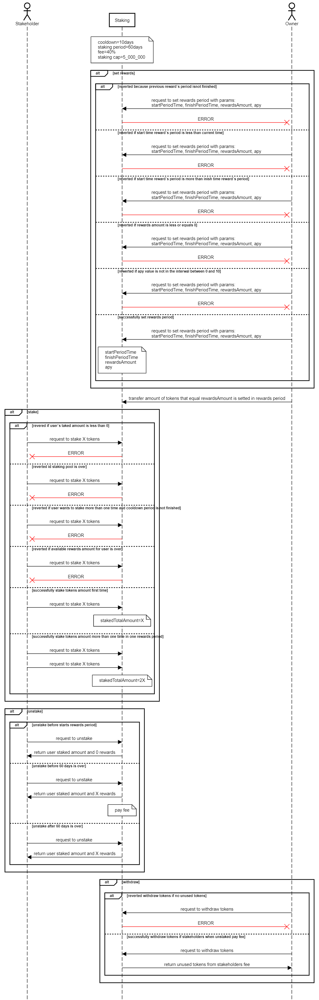

# High level diagram


# Use cases & Usage Scenarios

## StakingToken
A smart contract which will mint tokens that will be bought for using them in  the staking contract. 

StakingToken inherits *ERC20* contact from OpenZeppelin.

---

### Usage Scenarios
- **name()** - returns the name of the token;

- **symbol()** - returns the symbol of the token, usually a shorter version of the name;

- **decimals()** - returns the number of decimals used to get its user representation;

- **totalSupply()** - returns the amount of tokens in existence;

- **balanceOf(address account)** - returns the number of tokens owned by account;

- **transfer(address recipient, uint256 amount)** - moves amount tokens from the caller's account to recipient;

- **allowance(address owner, address spender)** - returns the remaining number of tokens that spender will be allowed to spend on behalf of owner through transferFrom(). This is zero by default;

- **approve(address owner, address spender)** - sets amount as the allowance of spender over the caller's tokens;

- **transferFrom(address sender, address recipient, uint256 amount)** - moves amount tokens from sender to recipient using the allowance mechanism. amount is then deducted from the caller's allowance;

- **increaseAllowance(address spender, uint256 addedValue)** - atomically increases the allowance granted to spender by the caller;

- **decreaseAllowance(address spender, uint256 subtractedValue)** - atomically decreases the allowance granted to spender by the caller;

---

## Vendor

A smart contract which will be responsible to allow users to exchange ETH for our Token.

Vendor contract inherits *Ownable* and using *IERC20* contracts from OpenZeppelin library.

### Usage Scenarios
- **buyTokens()** - get tokens by caller depending on how much wei was sent to contract

- **sellTokens(uint256 amount)** - transfer amount of tokens back to the contract

- **wirhdraw()** - allow the owner of the contract to withfrae eth

### Governance can:
- **setPrice(uint256 price)** - set price in wei for buy tokens

---

## Staking

A smart contract which implements staking functionality, with the main functions *stake* and *unstake*. 

User can stake tokens in reward`s period. To unstake tokens in first 10 days rewards will be 0, until 60 days user should pay fee, and only after 60 days user can get full rewards.

Have some static variables:
- **cooldown(10 days)** - to unstake, a user must first activate the cooldown timer, wait for the cooldown time to elapse, then redeem their staked tokens. 
- **staking period(60 days)**
- **fee(40% of the earned reward)** - send to contract by the recipient if he wants unstake earlier than stake is will be finished
- **staking cap(capability)** - 5mln = 5 000 000
- **staking pool** - 500 000 tokens and APY 10%

To calculate reward amount is using a formula

```
rewardAmount = stakedAmount * rewardRate * timeDiff / rewardInterval

- rewardRate - APY %
- timeDiff - currecnt timestamp - last timestamp(registered timestamp of the stakeholder)
- rewardInterval - 365 days
```

Staking contract inherits *Ownable*, *Counters* and using *IERC20* contracts from OpenZeppelin library.

---

### Usage Scenarios
- **stake(uint256 amount)** - transfer the amount of tokens from the user account and register staking for him
- **unstake()** - transfer all staked tokens and rewards to the user account and update staking details for him
 
 
### Governance can:
- **setRewards(uint256 start, uint256 finish, uint256 rewardsAmount, uint256 apy)** - add reward to contract for a specific period.
- **withdrawAmounts()** - withdraw amount that will be send to contract as fee 

### Struct
```
    struct Stakeholder {
        bool isStaked;
        uint256 stakedAmount;
        uint256 stakeTime;
        uint256 unstakeTime;
    }
```
*This struct sets data of stakeholder.*

- **isStaked** - check if stakeholder is already registered
- **stakedAmount** - how much stakeholder is staked
- **stakeTime** - timestamp when stakeholder stakes tokens
- **unstakeTime** - timestamp when stakeholder unstakes tokens

### Mapping

**mapping(address => Stakeholder) public stakeholders** - set stakeholders

---

## Events

### Vendor

- ```SettedPrice(uint256 amount);```

This event is emitted when new price for selling STakingToken is setted.

Arguments:

```
- amount - new price
```

- ```BoughtToken(address buyer, uint256 amountOfEth, uint256 amountOfTokens);```

This event is emitted when tokens will be bought by recipient

Arguments:
```
 - buyer - address who bought tokens
 - amountOfEth - how much recipient shoul pay
 - amountOfTokens - how much tokens recipient will get
``` 

- ```SoldToken(address seller,	uint256 amountOfTokens, uint256 amountOfEth); ```

This event is emitted when tokens will be sold by sender to recipient

Arguments:
```
 - seller - address who sold tokens			
 - amountOfTokens - how much seller will sell tokens
 - amountOfEth - how much seller receive eth 
``` 
 
---

### Staking

- ```AddedReward(uint256 start, uint256 finish, uint256 rewardsAmount, uint256 apy); ```

This event is emitted when new reward for staking period is added.

Aruments:
```
- uint256 start - start timestamp for reward period
- uint256 finish - finish timestamp for reward period
- uint256 rewardAmount - amount of reward for this reward period
- uint256 apy - annual percentage yield for this reward period
```

- ```Staked(address sender, uint256 amount); ```

This event is emitted when sender staked amount.

Arguments:
```
 - sender - address who send tokens for stake
 - amount - how much sent tokens for stake
```

- ```Unstaked(address recipient, uint256 amount, uint256 reward);```

This event is emitted when recipient unstake tokens.

Arguments:
```
 - recipient - address who get tokens	      
 - amount - amount of stake tokens
 - reward - amount of tokens after staking
```

---

## Sequence diagram

### Vendor


### Staking


---

## Third party library
The smart contracts inherit next SC from the **Openzeppelin** libraries verion *^4.5.0*:

**Ownable.sol** - access control

**Counters.sol** - get a counter that can only be incremented or decremented

**IERC20.sol** - the interface all ERC20 implementations

**SafeMath.sol** - library wrappers arithmetic operations with added overflow checks

## Risk and issues that can break the contract logic

Overflow and underflow - when calculated rewards amount in Staking contract, add or subtract to the value using like this 
```
stakingPoolTotalAmount += _amount;
```

Reordering attack - using public mapping than everyine in the blockchain can get info. Updating the condition at the beggining of the method. 


